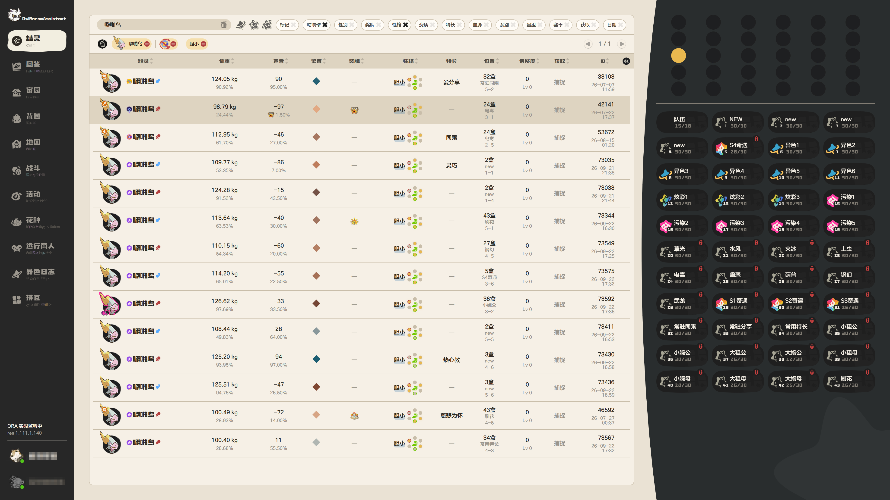
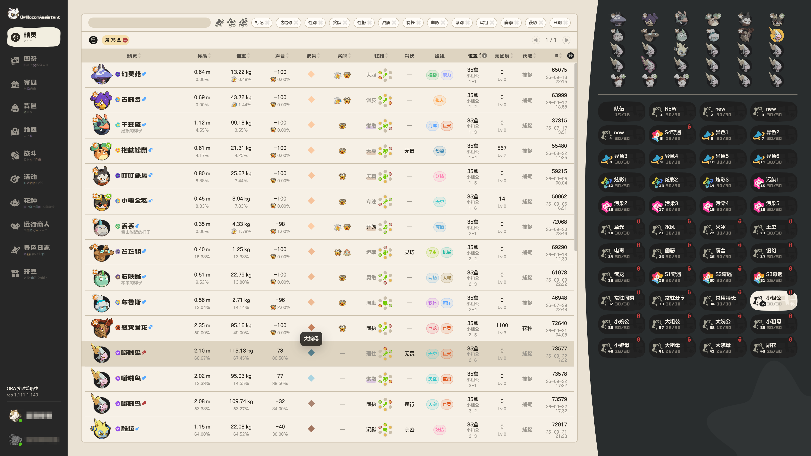
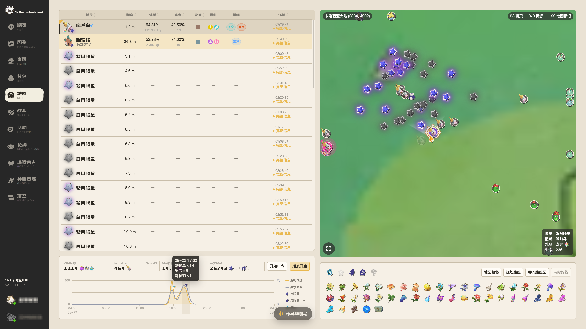
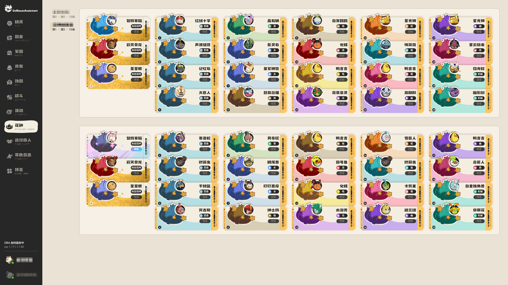
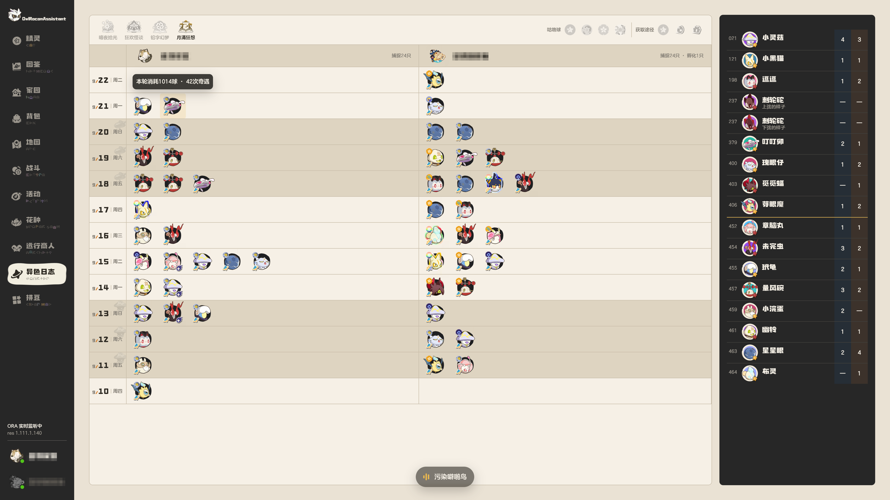

# OwlRocomAssistant

OwlRocomAssistant（ORA）是面向《洛克王国：世界》的本地数据助手。它将游戏实时状态、本地配置与收藏记录整理到统一界面中，帮助玩家查看精灵、探索、战斗、活动与个人收藏进度。

## 主要功能

- **精灵与图鉴**：同步队伍、盒位与精灵资料，支持体型、声音、性格、资质、特长、蛋组、外观、奖牌等多条件筛选与排序。
- **家园与背包**：查看种植、繁育、守卫、室内入住、物品、精灵蛋、货币和资产记录。
- **世界地图**：展示当前场景、附近精灵、采集资源、地图标记与捕捉统计，并提供目标关注和路线规划。
- **实时战斗**：呈现战斗模式、双方阵容、场上状态、技能、天气、伤害与战报。
- **活动与收藏**：汇总活动日历、花种、远行商人、异色日志和拼豆图纸。
- **多账号状态**：在同一界面中查看已配置账号的实时数据与历史记录。

## 界面预览

### 精灵

 

### 地图

### 花种

### 异色日志

## 本地运行

ORA 在本机运行，页面、服务与实时协议监听均使用本地回环地址。账号配置、个人记录与协议缓存保存在用户自己的设备中。

## 项目状态

ORA 正在持续开发和完善。本仓库用于展示产品界面、功能进展与版本信息，项目开发仓库独立维护。

本项目为玩家制作的辅助工具，与《洛克王国：世界》官方无隶属关系。相关游戏名称、图像和商标归其权利人所有。

© 2026 benzoic-acid. All rights reserved.
